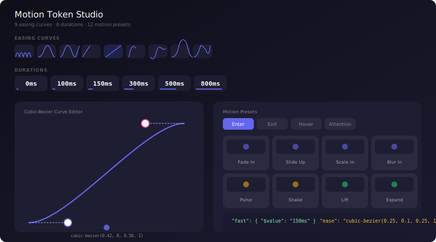

<p align="center">
  
</p>

<h1 align="center">Motion Token Studio</h1>

<p align="center">
  <strong>Visual Cubic-Bezier Editor · Duration Scale · Motion Presets · 5-Framework Export</strong>
</p>

<p align="center">
  <a href="https://lov-alt.github.io/motion-token-studio/"></a>
  <a href="https://github.com/lov-alt/motion-token-studio/stargazers"></a>
  <a href="LICENSE"></a>
</p>

<p align="center">
  
</p>

---

## Why

`cubic-bezier(0.34, 1.56, 0.64, 1)` — this is a spring animation. But you can't see that from the numbers alone.

Motion in UI design is governed by four opaque values. No designer can visualize a bezier curve from CSS. No developer wants to hand-write `@keyframes` for five frameworks. And existing tools — LottieFiles, Rive, GSAP — are either code-only, paid, or tied to a specific platform.

Motion Token Studio brings motion design into the **design token workflow**: visually edit curves, name your duration tokens, pick from production-ready presets, export to any framework. Same philosophy as Design Token Studio — define once, export everywhere.

| | Motion Token Studio | LottieFiles | Rive | GSAP Ease Visualizer |
|---|---|---|---|---|
| **License** | MIT · Free | Free tier · Proprietary | Free · Proprietary | Proprietary |
| **Bezier editor** | SVG drag handles + ball preview | No | Graph editor | Simple sliders |
| **Duration tokens** | Named scale with visual bars | No | No | No |
| **Motion presets** | 12 presets × 4 categories | Community only | Community only | No |
| **Export** | CSS / Framer / SwiftUI / Flutter | Lottie JSON | .riv binary | JS only |
| **Design token format** | W3C DTCG JSON | No | No | No |

---

## How It Works

```
Pick an easing curve   →   Tune the duration   →   Match a motion preset   →   Export to your stack
  (9 built-in or drag)      (named token scale)      (Enter/Exit/Hover/...)     (CSS / Framer / SwiftUI / Flutter)
```

---

## Modules

### Easing Curve Editor

The core. Drag two control points on an SVG canvas. The curve renders in real-time. A preview ball animates along the timing path so you can **feel** the motion before coding it.

- 9 built-in presets: ease, ease-in, ease-out, ease-in-out, linear, spring, bounce, decelerate, accelerate
- Numeric inputs for x1 / y1 / x2 / y2 — precision when you need it
- One-click copy: `transition: all 300ms cubic-bezier(0.42, 0, 0.58, 1);`

### Duration Tokens

Six named tokens from 0ms to 800ms, each with a visual timeline bar. Edit values inline. Export as CSS custom properties.

| Instant | Extra Fast | Fast | Normal | Slow | Gentle |
|---|---|---|---|---|---|
| 0ms | 100ms | 150ms | 300ms | 500ms | 800ms |

### Motion Presets

Twelve production-ready animation patterns across four categories. Hover any card to preview the motion.

| Enter | Exit | Hover | Attention |
|---|---|---|---|
| Fade In | Fade Out | Lift | Pulse |
| Slide Up | Slide Down | Expand | Shake |
| Scale In | | Highlight | Bounce |
| Blur In | | | |

Each preset maps to a duration + easing pair. Click for details and copy the CSS.

### Export

Five export formats, each with production-ready code:

| Format | Example output |
|---|---|
| **CSS transition** | `transition: opacity 300ms cubic-bezier(0, 0, 0.58, 1);` |
| **CSS @keyframes** | `@keyframes fadeIn { from { opacity: 0; } to { opacity: 1; } }` |
| **Framer Motion** | `<motion.div animate={{ opacity: 1 }} transition={{ duration: 0.3, ease: [0, 0, 0.58, 1] }} />` |
| **SwiftUI** | `.animation(.timingCurve(0, 0, 0.58, 1, duration: 0.3), value: appear)` |
| **Flutter** | `CurvedAnimation(parent: _ctrl, curve: Cubic(0, 0, 0.58, 1))` |

---

## Token Files

Drop-in W3C DTCG motion tokens — compatible with Figma Tokens Studio, Style Dictionary, Theo, Diez.

```bash
curl -O https://raw.githubusercontent.com/lov-alt/motion-token-studio/master/tokens/motion-tokens.json
```

[`tokens/motion-tokens.json`](./tokens/motion-tokens.json)

```json
{
  "duration": {
    "instant":   { "$value": "0ms" },
    "extra-fast": { "$value": "100ms" },
    "fast":       { "$value": "150ms" },
    "normal":     { "$value": "300ms" },
    "slow":       { "$value": "500ms" },
    "gentle":     { "$value": "800ms" }
  },
  "easing": {
    "ease":        { "$value": "cubic-bezier(0.25, 0.1, 0.25, 1)" },
    "ease-in":     { "$value": "cubic-bezier(0.42, 0, 1, 1)" },
    "ease-out":    { "$value": "cubic-bezier(0, 0, 0.58, 1)" },
    "ease-in-out": { "$value": "cubic-bezier(0.42, 0, 0.58, 1)" },
    "spring":      { "$value": "cubic-bezier(0.34, 1.56, 0.64, 1)" },
    "bounce":      { "$value": "cubic-bezier(0.68, -0.55, 0.27, 1.55)" }
  }
}
```

---

## Quick Start

```bash
git clone https://github.com/lov-alt/motion-token-studio.git
cd motion-token-studio
npm install
npm run dev          # http://localhost:5173
```

Instantly at **[lov-alt.github.io/motion-token-studio](https://lov-alt.github.io/motion-token-studio/)**.

---

## Ecosystem

Motion Token Studio is part of a four-tool open-source suite covering the full design-to-code pipeline:

```
Design Token Studio     →  CSS Visual Toolbox   →  Typography Lab        →  Motion Token Studio
┌─────────────────────┐   ┌───────────────────┐   ┌───────────────────┐   ┌──────────────────────┐
│ Define design        │   │ Visually edit      │   │ Generate layouts   │   │ Design motion        │
│ tokens (colors,      │   │ CSS properties     │   │ from content       │   │ tokens (easing,      │
│ type, spacing)       │   │ (clip-path,        │   │ archetypes         │   │ duration, presets)   │
│                      │   │ gradient, shadow)  │   │ (14 types, 8       │   │                      │
│                      │   │                    │   │ traditions)        │   │                      │
└─────────────────────┘   └───────────────────┘   └───────────────────┘   └──────────────────────┘
```

- **[Design Token Studio](https://github.com/lov-alt/design-token-studio)** — W3C DTCG token editor. Brand wizard, semantic colors, WCAG checker, image color extraction.
- **[CSS Visual Toolbox](https://github.com/lov-alt/css-visual-toolbox)** — Visual CSS property editor. clip-path, gradients, box-shadow, border-radius. 8-framework export.
- **[Typography Lab](https://github.com/lov-alt/typography-lab)** — Layout generator. 14 archetypes, 8 typographic traditions, local font import, 16 image blend modes.

---

## Project Structure

```text
motion-token-studio/
├── tokens/motion-tokens.json      # W3C DTCG motion tokens
├── src/
│   ├── engine/
│   │   ├── bezier.ts              # Cubic-bezier math + sampling + export
│   │   └── tokens.ts              # Default easing curves, durations, presets
│   ├── pages/
│   │   ├── Dashboard.tsx          # Curve miniatures + duration timeline + nav
│   │   ├── EasingEditor.tsx       # Interactive SVG bezier editor (core)
│   │   ├── Durations.tsx          # Duration token scale with visual bars
│   │   ├── Presets.tsx            # 12 motion patterns × 4 categories
│   │   └── ExportPage.tsx         # 5-format code export
│   ├── i18n/                      # zh / en
│   ├── App.tsx
│   └── main.tsx
├── docs/preview.svg
└── .github/workflows/deploy.yml
```

---

## Tech Stack

React 19 · TypeScript · Vite · Tailwind CSS v4 · React Router

## License

[MIT](./LICENSE) © 2026 lov-alt — Use freely, modify freely, distribute freely. Software provided "as is", without warranty of any kind.
